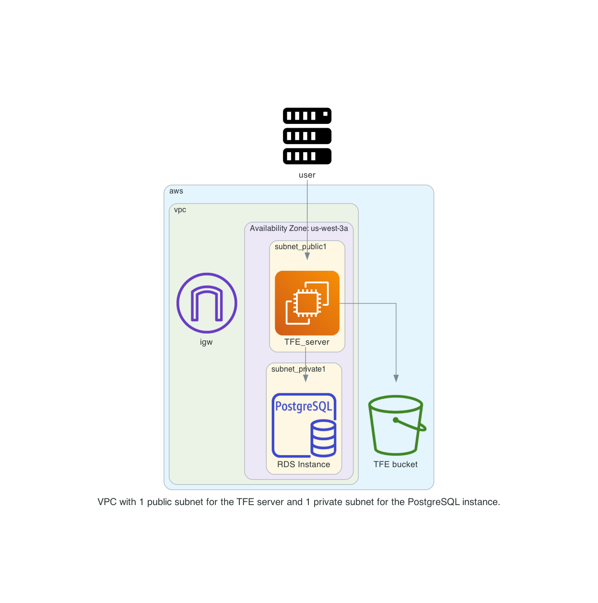

# TFE_airgap
Install TFE on Prod version External Services ( S3 + DB ) with Valid Certificate - AWS install with airgap

# Diagram

  

# Done
- [x] Create an AWS image to use with correct disk size and Docker software installed
- [x] build network according to the diagram
- [x] Create an AWS RDS PostgreSQL
- [x] create a virtual machine in a public network with public IP address.
    - [x] firewall inbound are all from user building external ip
    - [x] firewall outbound rules
          postgresql rds
          AWS bucket
          user building external ip
- [x] Create an AWS bucket
- [x] create an elastic IP to attach to the instance
- [x] transfer files to TFE virtual machine
      - airgap software
      - license
      - TLS certificates
      - Download the installer bootstrapper
- [x] install TFE
- [x] Create a valid certificate to use 
- [x] Get an Airgap software download
- [x] point dns name to public ip address

# Steps to do

# notes and links
[EC2 AWS bucket access](https://aws.amazon.com/premiumsupport/knowledge-center/ec2-instance-access-s3-bucket/)